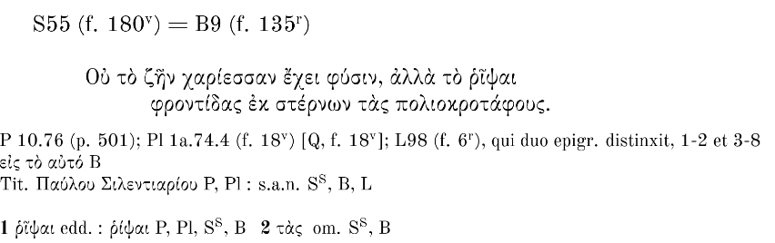

## Une matière terrible

>δεινὸν γάρ που, ὦ Φαῖδρε, τοῦτ᾽ ἔχει γραφή, καὶ ὡς ἀληθῶς ὅμοιον ζωγραφίᾳ^[«\ Ce qu'a de terrible l'écriture, Phèdre, est aussi qu'elle est vraiment semblable à la peinture.\ » _Ma traduction_. Mais ce qu'il faut surtout retenir de ce passage est l'anastrophe -- difficile à rendre en français dans cette phrase. δεινὸν, terrible, c'est le premier mot qui acquiert ici un poid très particulier.]. (`\Plato[Phèdre]{275}[d]`{=latex})

\lettrine{D}ans le dialogue connu pour sa critique de l'écriture et plus généralement de la matière, dans le texte qui fait l'éloge de l'immatérialité de l'âme opposée à la matérialité du corps, de l'immatérialité du λόγος opposée à la matérialité de la γραφὴ, Platon, par le choix d'un adjectif, nous révèle une conception bien plus complexe que le dualisme immatérialiste.

Pour le philosophe du monde des idées, l'écriture est δεινός\ : terrible. Elle n'est pas γἑλοιος -- ridicule --, qualificatif qu'il a utilisé, quelques répliques avant, pour parler de la rhétorique, l'art sans art (τέχνη ἄτεχνος) des sophistes^[λόγων ἄρα τέχνην, ὦ ἑταῖρε, ὁ τὴν ἀλήθειαν μὴ εἰδώς, δόξας δὲ τεθηρευκώς, γελοίαν τινά, ὡς ἔοικε, καὶ ἄτεχνον παρέξεται. «\ Celui qui ne connaît pas la vérité, mais qui poursuit l'opinion possède un art des discours bien ridicule, et un art sans art \ ». `\Plato[Phèdre]{262b}[10])`{=latex}.]. L'écriture est terrible, ou même horrible. L'écriture est quelque chose de très sérieux donc, quelque chose qui peut faire peur.

δεινός est un adjectif important dans le _Phèdre_, et pour Platon en général. Socrate l'avait déjà utilisé pour caractériser son propre discours contre l'amour.

Toujours avec une anastrophe il avait dit\ :

>δεινόν, ὦ Φαῖδρε, δεινὸν λόγον αὐτός τε ἐκόμισας ἐμέ τε ἠνάγκασας εἰπεῖν^[«\ Horrible, Phèdre, horrible discours est le discours dont tu t'es chargé et celui que tu m'as obligé à faire.\ » _Ma traduction_.]`(\Plato [Phèdre]{242}[d])`{=latex}

C’est aussi l’adjectif utilisé, par exemple, par Homère pour décrire Charybde\ :

>αὐτὰρ ἐπεὶ πέτρας φύγομεν δεινήν τε Χάρυβδιν^[«\ Après avoir fui les rochers et l'horrible Charybde...\ »] (`\Homer[Odyssée]{12}[260]`{=latex})

Charybde est horrible car elle est monstrueuse et démesurée. Δεινός est l’adjectif qui signifie la terreur provoquée par la démesure. Charybde dépasse les limites, elle franchit les frontières de l’humain et devient un monstre horrible et démesuré. Δεινός est ce que devient celui qui a péché de ὕβρις.

Mais δεινός est aussi l'adjectif utilisé par Socrate dans le _Banquet_ pour parler de l'amour (δεινὸς γόης, `\Plato [Banquet]{203}[d]`{=latex}). L'amour dépasse aussi l'humain, mais parce qu'il est divin, ou mieux, qu'il est un dieu.

Cet adjectif, si complexe, semble mal adapté à qualifier l'écriture dans le cadre du paradigme opposant une matière passive et donc inoffensive à une immatérialité active et productrice. Dans la langue grecque δεινός est un terme ambigu car il mélange son aspect négatif -- horrible, terrible -- avec une sorte d'admiration. Est horrible ce qui va au delà des limites qui semblent être imposées à l'humain, qui les dépasse et qui, de cette manière, acquiert un aspect divin.

Dépasser la mesure imposée pour les humains est une faute, mais aussi rend grand, admirable. L’homme qui pèche de ὕβρις devient finalement semblable à un dieu. Le blasphème est à la fois horrible, terrible et admirable, divin.

Hérodote utilise de cette manière l’adjectif, quand il parle d’un «\ homme terrible et sage\ »: ὦ βασιλεῦ, κοῖόν τι χρῆμα ἐποίησας, ἀνδρὶ Ἕλληνι δεινῷ τε καὶ σοφῷ δοὺς ἐγκτίσασθαι πόλιν ἐν Θρηίκῃ^[«\ Roi, qu'as-tu fais\ ? Tu as permis à un grec terrible et sage de construire une ville en Thrace…\ » Her. 5.23. _Ma traduction_.]

L’expression «\ σοφὸς καὶ δεινός ἀνήρ\ » (homme sage et terrible) semble être presque une expression figée en grec. 

Mais alors, si l'écriture est δεινός, c'est parce qu'elle viole les limites qui lui sont données. Elle ne reste pas là, passive, inerte, matérielle, dépourvue de sens. Elle parle, elle dit quelque chose, elle porte du sens.

Voilà pourquoi l'écriture est loin d'être ridicule. Elle fait peur justement parce qu'elle questionne une idée qui semblerait évidente à un lecteur superficiel du _Phèdre_\ : celle selon laquelle la pensée et le sens seraient des productions de l'humain ou du moins de ce que l'humain a de plus élevé, à savoir son âme, son côté immatériel. Et pourtant on constate sans cesse, dans le fameux dialogue, que cette idée ne fonctionne pas. Ce n'est jamais l'être humain qui pense. La pensée est toujours ailleurs.

Socrate n'arrête pas de le répéter\ : ce n'est pas lui qui produit ses discours\ ; ce sont les dieux du lieu, les Nymphes (`\Plato{238}[d]`{=latex}), les Muses (`\Plato{262}[d]`{=latex}), mais jamais lui.

L'hypothèse que je voudrais démontrer est que cet ailleurs est justement la matière. Je voudrais donc démontrer que c'est la matière qui pense -- même dans le _Phèdre_ de Platon.

Si cette hypothèse se révèle correcte, il devient nécessaire de revoir toute notre conception de l'émergence du sens. Si la matière pense\ : quelle est la place de toutes ces activités et de toutes ces composantes matérielles -- et pour cela considérées systématiquement comme triviales et banales -- qui ont pourtant un rôle fondamental dans la production du sens\ ? Plus en particulier\ : quelle est la place des différentes activités éditoriales\ ? Du choix d'un format -- papier ou numérique -- aux activités de relecture, révision, mise en forme, composition, fabrication...\ ? Quelle est la place des logiciels, des algorithmes, des supports\ ?

À l'époque des _Large Language Models_, peut-être faut-il se poser de façon complètement renouvelée la question de qui produit le sens... de qui pense.

Or, puisque la production de pensée semble être la caractéristique sur laquelle se fondent notre compréhension et notre définition de l'humain, cette réflexion a comme corollaire une mise en question radicale de ce que nous sommes et de ce qui constitue, dans le sens le plus profond, notre prétendue essence.

## Le mauvais cigare

\lettrine{P}our bien saisir l'enjeu théorique qui est au centre de ces questions et en particulier le rôle de ce qui semble être trivialement matériel dans la production et l'émergence du sens, il est utile de s'arrêter sur une anecdote à propos d'une des expériences fondamentales pour la physique quantique, l'expérience de Stern et Gerlach, racontée par Bretislav Friedrich et Dudley Herschbach [@friedrich_stern_2003] et ensuite reprise par Karen Barad [@barad_meeting_2007].

L'expérience a été imaginée par Otto Stern pour vérifier une hypothèse de Niels Bohr sur la structure de l'atome. Selon Bohr, l'orientation du plan orbital des électrons autour du noyau de l'atome ne pourrait prendre que certaines valeurs discrètes. L'espace serait donc discret et non continu\ : c'est l'idée de la «\ quantification de l'espace\ ». Cette idée est évidemment contraire à l'idée d'espace continu et dense de la physique classique.

Stern, en 1921, imagine donc une expérience pour tester l'hypothèse de Bohr. Un appareil qui fera passer un faisceau d'atomes d'argent entre deux aimants jusqu'à arriver sur un écran de verre. Si l'hypothèse de Bohr est juste, le faisceau devrait se diviser en deux, sinon, dans l'hypothèse d'un espace continu, on devrait avoir sur le verre une tâche homogène d'atomes.

Stern, pour réaliser l'expérience, s'adresse à son collègue Walther Gerlach. L'expérience est difficile et délicate à mettre en place et demande plusieurs nuits de travail à Gerlach. À la fin, les deux chercheurs arrivent à produire ce qu'ils souhaitent, mais en regardant la plaque de verre, ils ne voient rien. Voici le récit de Stern\ :

>After venting to release the vacuum, Gerlach removed the detector flange. But he could see no trace of the silver atom beam and handed the flange to me. With Gerlach looking over my shoulder as I peered closely at the plate, we were surprised to see gradually emerge the trace of the beam.. . . Finally we realized what [had happened]. I was then the equivalent of an assistant professor.
My salary was too low to afford good cigars, so I smoked bad cigars. These had a lot of sulfur in them, so my breath on the plate turned the silver into silver sulfide, which is jet black, so easily visible. It was like developing a photographic film.^[«Après avoir évacué le vide, Gerlach retira la plaque du détecteur. Mais il ne voyait aucune trace du faisceau d'atomes d'argent et me tendit la plaque. Avec Gerlach qui regardait par-dessus mon épaule pendant que j'examinais attentivement la plaque, nous fumes surpris de voir émerger progressivement la trace du faisceau... . . Nous comprimes enfin ce qui s'était passé. J'étais alors l'équivalent d'un professeur adjoint.
Mon salaire était trop bas pour me permettre d'acheter de bons cigares, alors je fumais de mauvais cigares. Ceux-ci contenaient beaucoup de soufre, et mon souffle sur la plaque a transformé l'argent en sulfure d'argent, qui est d'un noir de jais et donc facilement visible. C'était comme développer une pellicule photographique.» _Ma traduction_. Ce texte est reconstruit par Herschbach suite à une conversation privée avec Stern qui a eu lieu en 1960 et cité dans @friedrich_stern_2003]

Ce texte vaut la peine d'être analysé attentivement car il met en crise de façon exemplaire l'idée d'une pensée immatérielle, idéale, abstraite de toute composante «\ bassement matérielle\ ».

Comme le souligne Barad [@barad_meeting_2007 p. 165 et ss.], ce récit questionne l'idée d'un dispositif d'observation dont les limites et les frontières sont très nettement définies. Où commence l'instrument et où finit-il\ ? Le dispositif mis en place par Stern et Gerlach ne donne pas le résultat espéré. Le cigare doit faire partie du dispositif. Mais pas n'importe quel cigare\ : un mauvais cigare. Cela implique donc que même le salaire de Stern, et les raisons de ce salaire -- combien est payé un professeur adjoint -- font partie du dispositif d'observation. Par ailleurs, si on continue l'analyse, l'hypothèse de Stern n'était pas juste\ : en réalité ce que montre l'expérience, plus que la quantification de l'espace, c'est le fait que les électrons ont un spin. Cette expérience devient fondamentale dans les livres de physique seulement plusieurs années après, et justement en tant que démonstration du spin.

L'interprétation selon laquelle une personne brillante -- ici Stern -- a une idée géniale, la définit de façon formelle et abstraite et ensuite la démontre avec un dispositif aux frontières claires et bien définies est complètement invalidée. L'idée, la théorie sont le résultat d'une série de facteurs dont font partie les conditions économiques d'un professeur adjoint en 1920, le rapport entre le coûts des cigares et la présence de soufre, la visibilité du sulfure d'argent sur du verre et l'invisibilité de l'argent, le travail d'une large communauté de recherche qui s'interroge sur des résultats expérimentaux pendant plusieurs décennies, etc.

Le dispositif d'observation n'est pas idéal -- dans le sens de quelque chose dont la matérialité n'est qu'un accident car ce qui compte n'est que la structure formelle\ : le dispositif est la matière et c'est cette matière complexe, qui comprend des éléments comme le sulfure d'argent et comme le niveau de reconnaissance économique d'un jeune professeur, c'est cette matière complexe qui fait émerger une idée. La théorie est un agencement matériel d'une série d'éléments.

Barad résume tout cela avec la phrase\ : _matter matters_. C'est ce que je veux dire ici quand j'affirme\ : c'est la matière qui pense.

## La théorie de l'édition

\lettrine{M}ais qu'est-ce qu'un mauvais cigare a à voir avec l'édition\ ?

Le monde du texte a souvent été pensé sur la base des mêmes présupposés idéalistes -- ou plutôt «\ immatériels\ » -- qui caractérisent l'interprétation de la physique que nous venons de questionner. 

Cette idéologie, quelque peu caricaturée, je l'admets, met au sommet d'une pyramide symbolique le sens et la pensée qui seraient immatériels -- comme le λόγος de la _doxa_ platonicienne. Le texte aussi est idéalisé et pensé comme abstrait de son incarnation matérielle. Il y aurait quelque chose comme un texte idéal. Cette idée abstraite du texte est par ailleurs très présente dans ce qu'on pourrait appeler la _doxa_ post-structuraliste^[Sur ce sujet, cf. l'analyse de @archibald_texte_2009. Analyse bien résumée par cette phrase, que je partage\ : «\ Le texte, tel qu'il se conçoit depuis 50 ans, est un
objet pour ainsi dire purement sémiotique, un objet virtuel construit au-dessus et au-delà de toute
matérialité\ » p. 20.]\ : le texte de Kristeva avec une idée d'intertextualité très peu incarnée, mais même le texte -- et l'écriture -- de Derrida -- qui malgré sa critique de l'immatérialité phallocentrique de Platon, s'empresse de souligner -- justement dans la _Pharmacie de Platon_ [@derrida_pharmacie_1968] où il propose son analyse du _Phèdre_ -- que «\ un texte reste d'ailleurs toujours imperceptible\ » et qui donne à la fin une idée d'écriture fortement désincarnée<!--cette phrase n'est pas finie ? J'ai pas compris-->.

Cette idéologie se concrétise dans un dispositif d'attribution de valeur symbolique, un dispositif social et culturel dont l'objectif ultime est de produire des hiérarchies, des concentrations de pouvoir, des distinctions de classe. Un dispositif qui crée donc des élites et des subalternes. La distinction entre élite et subalternes se fait justement sur la base du niveau de matérialité de leurs tâches et de leurs compétences\ : du côté de l'immatérialité, et du «\ texte toujours imperceptible\ », l'élite, qui ne manipule rien, qui pense, d'une pensée idéale dont les idées demeurent dans l'hyperouranion. Les mains blanches et lisses, le genre toujours masculin, possiblement une barbe, une cravate, un mépris pour tout ce qui est vilement matériel. De l'autre côté, celles et ceux qui touchent un texte tout à fait perceptible, un texte qui salit les mains et les abime, un texte qui ne semble pas demander de la pensée, mais de l'action. Et ces personnes sont souvent des femmes, ou des pauvres. D'un côté la théorie et l'élite, de l'autre la pratique et les subalternes.

L'édition est, en bonne partie, du côté de la pratique. En bonne partie, dis-je, car certains aspects du métier ont certes été idéalisés, sacralisés même. Il est possible de trouver la figure du «\ grand éditeur\ » -- encore une fois, toujours au masculin. Mais cet éditeur aura très probablement peu souvent à toucher une presse, ou à corriger une coquille.

L'édition dans son aspect matériel, dans sa composante qui touche aux supports (comme la composition, la révision, l'impression) est pratique, elle ne demande pas -- ou elle semble ne pas demander, car c'est justement cette idée que je vais essayer de renverser -- de la théorie.

Les premières pages d'_Illusions perdues_, un roman qui propose une des réflexions les plus profondes sur le monde de l'impression, mettent justement en scène ce dispositif de production des élites et des subalternes en représentant le petit monde qui tourne autour des presses mécaniques.

>Ce Séchard était un ancien compagnon pressier, que dans leur argot typographique les ouvriers chargés d’assembler les lettres appellent un Ours. Le mouvement de va-et-vient, qui ressemble assez à celui d’un ours en cage, par lequel les pressiers se portent de l’encrier à la presse et de la presse à l’encrier, leur a sans doute valu ce sobriquet. En revanche, les Ours ont nommé les compositeurs des Singes, à cause du continuel exercice qu’ils font pour attraper les lettres dans les cent cinquante-deux petites cases où elles sont contenues. 

Le ton moqueur de ce passage exprime sans ambiguïté le peu de considération que l'on doit attribuer à des métiers de ce type. Ce sont les bras qui servent -- de façon aveugle, sans rien apporter à la production du sens -- une pensée. Ces artisans de l'édition ne font clairement pas partie de l'élite qui pense. Leurs tâches n'ont aucune valeur symbolique. Et c'est la raison pour laquelle leurs sobriquets les transforment en animaux. Animaux, machines et subalternes forment une unité\ : tous ceux qui se trouvent du côté de la matière et qui n'ont aucun rapport avec le monde immatériel de la pensée.

Bien évidemment, même dans le monde des subalternes, il y a des hiérarchies, et Balzac s'amuse à en jouer\ :

>l’Ours solitaire était incapable de se transformer en Singe ; car, en sa qualité d’imprimeur, il ne sut jamais ni lire ni écrire. 

Si l'édition ne peut qu'être considérée comme une pratique, car elle touche à la matérialité du texte, à la matière dans laquelle hélas la pensée est contrainte de s'incarner, il est aussi vrai que ce même monde de l'édition peut être hiérarchisé dans une pyramide au sommet de laquelle il y aura les personnes qui prennent des décisions, qui choisissent des manuscrits et une ligne éditoriale, qui peuvent faire un discours lors d'une soirée de lancement d'un livre. Ensuite viennent les réviseurs, les compositeurs, les graphistes, les imprimeurs. Et là on est convaincu qu'il n'y a plus de sens en jeu. 

C'est le moment de repenser au cigare de Stern\ : et si le mouvement de va-et-vient de l'ours avait en réalité un rôle fondamental dans l'émergence du sens\ ? Et si la naissance des idées ne se faisait pas, en réalité, dans la tête des élites, mais dans l'ensemble d'interactions matérielles où la réflexion du grand philosophe ou du grand romancier n'avait finalement pas plus de poids que la structuration des cent cinquante-deux cases des presses balzaciennes -- ou du format docx auquel nous avons réduit nos chaînes de production actuelles\ ?

Si cela était vrai, il faudrait alors regarder l'édition d'un autre \oe il et ne plus la considérer comme une pratique, mais comme une théorie. 

La théorie de l'édition est l'approche nécessaire pour comprendre de quelle manière le sens émerge d'un contexte matériel particulier. Selon ce point de vue, il n'y a plus de hiérarchie parce qu'il n'y a plus une séparation entre matière et immatérialité. Et non seulement il n'y a plus une hiérarchie qui classe les êtres humains (le grand auteur en haut et la petite secrétaire en bas), mais il n'y a plus de hiérarchie qui sépare ce qui peut être produit par l'humain de ce qui est produit par un format, la composition d'une encre, la coupe d'une feuille de papier, l'électricité qui fait tourner un processeur. C'est la matière qui pense.

## Formats et modèles

\lettrine{C}oncentrons-nous maintenant sur les textes. La question à laquelle il semble nécessaire de trouver une réponse est la question ontologique\ : qu'est-ce qu'un texte\ ? Je vais essayer de montrer que cette question est mal posée, ou plutôt qu'il serait inapproprié d'en attendre _une_ réponse -- une seule. Il faudrait plutôt se demander\ : de quelle manière décidons-nous d'interpréter _ce_ texte particulier\ ? La question ontologique prétend une réponse unique et qui relève d'une essence universelle. L'essence serait quelque chose d'immédiat et donc d'unique. Mais on peut au contraire imaginer une essence médiate, qui émerge justement d'une série d'inter-actions -- ou intra-actions, pour utiliser le langage de Karen Barad^[Barad souligne le fait que le mot «\ interaction\ » présuppose la préexistance de deux pôles entre lesquels, ensuite, se crée une relation. Elle propose donc le mot intra-action pour signifier une relation qui serait antérieure aux pôles qu'elle relie, pôles qui seraient le résultat et non le présupposé de la relation.]. Pensez au cigare de Stern\ : le phénomène du spin qui en émerge n'est pas l'essence immédiate de l'électron, mais le résultat d'une interaction de forces en jeu, forces formées par le dispositif d'observation ainsi que par ses caractéristiques matérielles et discursives\ : le cigare, le salaire de Stern, le sulfure d'argent... tout cela fait partie du phénomène. Un électron serait une autre chose dans un contexte d'observation différent.

Et ainsi pour le texte\ : le texte est le résultat d'une série d'intra-actions. Une série de dynamiques qui deviennent les observables. La manière de choisir ces dynamiques -- de délimiter l'observation et de la cadrer -- relève d'un choix et a toujours quelque chose d'arbitraire. Ou mieux, ce choix est l'adoption d'un paradigme épistémologique particulier\ : légitime^[Un, mais pas n'importe lequel. Réalisme<!-- ?-->] mais situé.

Je vais essayer d'expliquer cette formulation qui peut sembler obscure avec des exemples. 

Posons-nous la question «\ qu'est-ce qu'un texte\ ?\ » à partir de cet objet\ :

>οὐ τὸ ζῆν χαρίεσσαν ἔχει φύσιν, ἀλλὰ τὸ ῥῖψαι   
φροντίδας ἐκ στέρνων τὰς πολιοκροτάφους.^[Ce n'est pas le fait de vivre qui a une nature agréable, mais le fait d'éloigner du c\oe ur les préoccupations qui font vieillir. _Ma traduction_.]

Nous pourrions dire que c'est un distique élégiaque, deux vers, un hexamètre et un pentamètre, en grec. 

Nous avons donc une définition, une théorie qui nous permet d'interpréter le texte et en même temps de le modéliser.

On pourrait penser que cette théorie précède toute manifestation matérielle du texte. Dans ce sens on pourrait imaginer qu'il y a d'abord une théorie du texte et ensuite une implémentation de cette théorie dans une manifestation matérielle. Selon cette idée, la partie théorique serait indépendante de la partie matérielle. Indépendante et, bien évidemment, plus importante. On peut schématiser ce point de vue comme suit\ : il y a d'abord une théorie du texte, une interprétation discursive qui relève du sens, et qui émerge des capacités herméneutiques d'un lecteur -- dans ce cas plutôt d'un expert, d'un helléniste, d'un philologue. Ce philologue serait l'esprit qui pense et qui produit le sens. Ce sens est ce qu'on pourrait appeler le «\ modèle théorique\ ». Ici, le modèle théorique est\ : «\ un distique élégiaque composé par deux vers, un hexamètre et un pentamètre\ ». Ce modèle théorique serait ensuite incarné dans un modèle matériel\ : le texte dans la mise en forme que vous voyez ici.

Mais, si on y prête un peu plus d'attention, on se rend compte que la mise en forme particulière que je propose ici, comme première approche à ce texte, joue un rôle fondamental pour pouvoir donner la réponse. La mise en forme donne la possibilité d'identifier les vers, ou mieux, les vers sont la mise en forme qui permet ensuite une lecture et une scansion métrique.

Regardons une autre manifestation de ce texte\ :

>AP 10.76, **Paul le Silentiaire**   
>οὐ τὸ ζῆν χαρίεσσαν ἔχει φύσιν, ἀλλὰ τὸ ῥῖψαι   
φροντίδας ἐκ στέρνων τὰς πολιοκροτάφους.
[...]

Ici le texte serait sans doute défini d'une autre manière\ ; par exemple\ : «\ il s'agit des deux premiers vers d'une épigramme du dixième livre de l'Anthologie Palatine écrite par Paul le Silentiaire\ ».

Les crochets avec les trois petits points expriment l'extraction du texte d'un contexte plus large. Ce concept d'extraction n'était pas présent dans la première version. La première ligne exprime l'appartenance de ce qui suit à une \oe uvre et en explicite l'auteur. Le concept d'\oe uvre et d'auteur viennent d'apparaître, alors qu'ils n'existaient pas dans la première manifestation.

<!-- Cette manifestation a un lien avec cette autre que je présente ici comme une image. Je dis bien "elle a un lien", car elle est loin d'être équivalente. -->

<!--  -->

<!-- Dans ce cas nous pouvons encore une fois changer notre modèle théorique... -->

Allons maintenant dans des manifestations matérielles plus complexes\ :

\scriptsize

\begin{minted}{latex}
\begin{edition}
\ekddiv{
    type=epigram,
    head=\getsiglum{S}55 (f. 180\textsuperscript{v}) = %
    \getsiglum{B}9 (f. 135\textsuperscript{r}),
    n=6
}
\note[type=testium,nosep,nonum,labelb=S55_1a,labele=S55_2e]%
{\getsiglum{P} 10.76 (p. 501)}
\note[type=testium,nosep,nonum,labelb=S55_1a,labele=S55_2e]%
{\getsiglum{Pl} 1a.74.4 (f. 18\textsuperscript{v}) %
[\getsiglum{Q}, f. 18\textsuperscript{v}]}
\note[type=testium,nosep,nonum,labelb=S55_1a,labele=S55_2e]%
{\getsiglum{L}98 (f. 6\textsuperscript{r}), 
qui duo epigr. distinxit, 1-2 et 3-8}
\note[type=lemmata,nosep,nonum,labelb=S55_1a,labele=S55_2e]%
{εἰς τὸ αὐτό \getsiglum{B}}
\note[type=tituli,nosep,nonum,labelb=S55_1a,labele=S55_2e]%
{Tit. Παύλου Σιλεντιαρίου \getsiglum{P}, \getsiglum{Pl}}
\note[type=tituli,nosep,nonum,labelb=S55_1a,labele=S55_2e]%
{s.a.n. \getsiglum{Ss}, \getsiglum{B}, \getsiglum{L}}
\begin{ekdverse}[type=hexdact]
\indentpattern{01}
\begin{patverse}
Οὐ τὸ ζῆν χαρίεσσαν ἔχει φύσιν, ἀλλὰ τὸ \app{
    \lem[sep={~: }, source=edd]{ῥῖψαι}
    %alt = edd. ; devrais peut-être Declare a Short Hand plutôt ?
    \rdg[wit={P, Pl, Ss, B}]{ῥίψαι}
}
\\
φροντίδας ἐκ στέρνων \app{
    \lem[sep={~}, nodelim]{τὰς}
    \rdg[wit={Ss, B}, alt=om.]{}
}
πολιοκροτάφους. \linelabel{S55_2e} \\
\end{patverse}
\end{ekdverse}
\end{edition}
\end{minted}

\normalsize

Cet encodage des deux vers en utilisant le paquet \LaTeX\  `ekdosis` (réalisé par Mathilde Verstraete sur la base d'une édition de Lucia Floridi)^[Évidemment j'ai omis le _cospectus siglorum_ qui est nécessaire pour que les annotations sémantiques aient un sens.], produit ensuite, une fois qu'il est compilé avec LuaLaTeX deux sorties, une en pdf qui donne le résultat suivant\ :

{ width=400px height=150px}

et une en XML-TEI, qui donne le résultat suivant\ :

\scriptsize
\begin{minted}{xml}

  <head>
    <ref target="Ss1 #s2 #s3 #s4 #B #B1">S</ref>
    55 (f. 180<hi rend="sup">v</hi>) = <ref target="#B">B</ref>
    9 (f. 135<hi rend="sup">r</hi>)
  </head>
  

    <note type="testium" target="#range(right(S55_1a),left(S55_2e))">
    <ref target="#P">P</ref> 10.76 (p. 501)</note>
    <note type="testium" target="#range(right(S55_1a),left(S55_2e))">
    <ref target="#Pl">Pl</ref> 1a.74.4 (f. 18<hi rend="sup">v</hi>) 
   [<ref target="#Q">Q</ref>, f. 18<hi rend="sup">v</hi>]</note>
    <note type="testium" target="#range(right(S55_1a),left(S55_2e))">
    <ref target="#l">L</ref>98 (f. 6<hi rend="sup">r</hi>), 
    qui duo epigr. distinxit, 1-2 et 3-8</note>
    <note type="lemmata" target="#range(right(S55_1a),left(S55_2e))">εἰς τὸ αὐτό 
    <ref target="#B">B</ref></note>
    <note type="tituli" target="#range(right(S55_1a),left(S55_2e))">
    Tit. Παύλου Σιλεντιαρίου <ref target="#P">P</ref>, 
    <ref target="#Pl">Pl</ref></note>
    <note type="tituli" target="#range(right(S55_1a),left(S55_2e))">
    s.a.n. <ref target="Ss1 #s2 #s3 #s4 #B,B1s1 #s2 #s3 #s4">S
    <hi rend="sup">S</hi></ref>, 
    <ref target="#B">B</ref>, <ref target="#l">L</ref></note>
    <anchor xml:id="S55_1a"/>
  

  <lg type="hexdact">
    <l>Οὐ τὸ ζῆν χαρίεσσαν ἔχει φύσιν, ἀλλὰ τὸ 
    <app><lem source="#cramer_anecdota_1841,piccolos1 #s2 #s3,s4_s1 #s2 #s3,
    s4upplement_1853-1 #page_further_1981-2">ῥῖψαι</lem>
    <rdg wit="#P #Pl, Ss1 #s2 #s3 #s4 #B,B1s1 #s2 #s3 #s4 #B">ῥίψαι</rdg></app> </l>
    <l>φροντίδας ἐκ στέρνων 
    <app><lem>τὰς</lem><rdg wit="Ss1 #s2 #s3 #s4 #B,B1s1 #s2 #s3 #s4 #B"/></app> 
    πολιοκροτάφους. <anchor xml:id="S55_2e"/> </l>
  </lg>

\end{minted}
\normalsize

Cherchons à identifier les éléments principaux qui sont exprimés dans ces manifestations matérielles des deux vers. Évidemment le modèle textuel ici est bien plus complexe. Cela ne signifie pas que les précédents étaient moins légitimes, juste qu'ils se concentraient sur un nombre plus limité d'aspects. La délimitation du contexte était différente.
De ces aspects additionnels qui sont exprimés dans les représentations qu'on vient de voir, il est nécessaire de préciser qu'ils ne sont pas des notions abstraites qui se trouvent dans l'esprit du philologue qui ensuite trouve une manière pour les incarner dans une représentation matérielle<!--répétition qui et trouve-->. C'est plutôt le contraire\ : ces aspects ne peuvent exister que parce qu'il y en a une manifestation matérielle. C'est l'existence de certaines syntaxes particulières, l'habitude du philologue à les pratiquer -- à manipuler des éditions critiques, à les produire -- qui fait en sorte qu'elles peuvent exister. C'est parce que le format d'ekdosis me demande de renseigner une variante et offre une incarnation syntaxique spécifique de la variante que l'idée même de variante peut exister -- dans le sens spécifique qu'elle acquiert ici, du moins -- et que je suis obligé de me poser la question des différentes versions du texte dans des témoins différents^[Pour une analyse cf @Alessi2020b @Debouy2021a]. La syntaxe pose des questions, soulève des problèmes, oblige à donner des renseignements, met devant des nécessités, des possibilités et des impossibilités. Une annotation de Mathilde Verstraete en témoigne. Verstraete écrit (ligne ...)\ : «\ %alt = edd. ; devrais peut-être Declare a Short Hand plutôt ?\ ». En effet, la syntaxe ekdosis permet de produire des informations sémantiques à propos des témoins qui sont déclarés dans le préambule et ensuite appelés dans l'appareil critique. Cela n'est évidemment pas possible en utilisant un logiciel comme Microsoft Word et Mathilde Verstraete est en train de transcrire depuis une édition faite avec ce logiciel par Lucia Floridi. Or, une annotation comme `edd.` signifie que la variante est attestées dans les textes des éditeurs, mais cela ne spécifie pas lesquels. Lucia Floridi entend donc, avec cette annotation se référer au fait que tous les éditeurs intègrent une correction évidente. Mais qu'est-ce que cela signifie d'un point de vue sémantique\ ? Doit-on comprendre que la correction est présente dans toutes les éditions\ ? Si c'est ainsi, pour traduire cette information en balisage sémantique il est nécessaire de prendre une décision aux implications théoriques fortes\ : par exemple créer un groupe de témoins déclarés comme ensemble dans le préambule -- une famille de `Short hands`. La syntaxe ekdosis pose donc une question épistémologique qui n'existe pas dans le format docx et qui doit être traitée philologiquement.

<!--Commentaire Mathilde à intégrer pour bonifier l'explication:
J'essaie de me remettre dedans mais c'est un peu loin ; je pense que le "edd" m'embête. C'est editiones, donc les éditeurs estiment que c'est ῥῖψαι ; mais en terme de données (je pense au xml), edd, ça veut rien dire. Je me demandais si je devais pas créer une Short Hand, soit l'équivalent d'une famille, pour regrouper ce que Lucia entend par éditions
-->

Comme Robert Alessi le précise dans la documentation du paquet\ :

>**Terminology** Strictly speaking, the term “witness” should apply to any manuscript
evidence dating back to the Middle Ages used by the editor to establish the edition text.
That said, editors often consult many other types of documents, such as modern editions,
articles, notes, correspondence and the like, all of which fall into the category of “sources”.
Furthermore, unpublished conjectures are also taken into account, not to mention the
corrections and emendations that are proposed in many places by the editor of the text. As
it is necessary to refer to scholars as individuals, “scholars” naturally emerges as a third
category.
Any reference that is to be used in the apparatus criticus must be “declared” in the
preamble beforehand, namely: manuscript sigla (either for single manuscripts or manuscript
families, primary or later hands, &c.), abbreviated last names of sources and scholars. [@ekdosis]

Pour revenir au sens du texte dans ces trois manifestations, il faut, par ailleurs, souligner un changement important de son sens\ : il ne s'agit plus de l'épigramme 76 du livre 10 de l'Anthologie Palatine, mais de l'épigramme 55 de la _Silloge Parisina_ qui, comme nous le dit l'appareil critique, correspond aux deux premiers vers de AP 10.76. Le texte est donc pensé comme une tradition qui se transmet par des canaux particuliers -- des manuscrits. Ce texte a donc des variantes. Cet encodage montre qu'il n'y a pas une intention d'établir laquelle de ces variantes est la «\ bonne\ », mais plutôt de rendre compte d'une tradition multiple et hétérogène. 

Il est important de souligner que le modèle originaire est celui de l'encodage \LaTeX\  et que les deux autres sont dérivés. Et pourtant, si on se concentre sur chacun des trois de façon séparée, nous pouvons remarquer que la notion de texte qu'ils proposent est complètement différente.

Pour résumer, l'encodage \LaTeX\  nous présente le texte comme une série d'actions qui doivent se déclencher au moment de la lecture. Le texte est donc une suite linéaire de symboles qui déclenchent des actions de production de sens. L'ouverture du paragraphe, par exemple, avec la commande `\ekdiv` demande de faire des opérations de mise en forme en ce qui concerne le format pdf -- et donc la sortie mise en page --, demande aussi d'aller «\ chercher\ » dans le conspectus siglorum la référence aux lettres qui constituent l'argument, demande aussi de produire l'XML qui transforme ces informations en une série de données exprimées dans un arbre XML.

L'idée de texte qui ressort du balisage XML est, au contraire, une idée de données structurées dans une hiérarchie arborescente. Or ces deux notions (le texte comme suite linéaire de symboles qui déclenchent une action ou le texte comme ensemble de données structurées dans un arbre) ne sont pas réductibles l'une à l'autre. La première est assez proche d'une modélisation possible de la lecture d'un document\ : le lecteur avance et au fur et à mesure qu'il trouve des symboles qui sont signifiants pour lui, il les met en relation et produit un sens et une interprétation. Quand le lecteur voit "L98", ces symboles déclenchent une action qui est celle de relier le texte qui suit au manuscrit qui a été précédemment identifié avec la lettre L. La lecture continue, de manière linéaire, et le mouvement des yeux -- qui passent d'un symbole à l'autre, parfois se déplaçant dans la page, de l'appareil critique au texte et _vice versa_ -- correspond à une série d'actions qui produisent des relations et font émerger le sens. Le modèle de texte qui ressort du balisage XML est complètement autre. Le texte n'est pas une suite linéaire de caractères, mais une structure hiérarchique d'éléments imbriqués dans un arbre.  Il n'y a aucune linéarité et l'ensemble des balises qui concernent un élément -- par exemple les variantes -- constituent une totalité de données non ordonnées de manière temporelle. Ce modèle essaie de saisir le texte en tant que données, informations objectives et qui expriment un sens qui leur est homothétique. Le sens ne dérive pas du balisage, le sens _est_ le balisage. Dans le modèle du XML-TEI, une série de caractères «\ est une variante\ » -- l'XML produit une vision du texte qui consiste en des d'attributs ontologiques --, alors que dans le modèle précédent, une série de caractères demande des actions\ : faire le lien avec un autre manuscrit qui porte un texte différent.

Ces exemples démontrent deux principes qui sont au c\oe ur de la théorie de l'édition que je propose ici. Le premier est que la matérialité du texte est son sens et qu'il n'est pas possible d'imaginer une théorie du texte qui fasse abstraction de cette matérialité. Le second est qu'il n'est pas possible de trouver une modélisation du texte qui soit universelle, car chaque configuration matérielle particulière donnera lieu à un contexte d'observation déterminant non seulement un paradigme épistémologique mais aussi une essence du texte. Il y aura donc plusieurs essences du texte, non pas une ontologie, mais une multiplicité d'ontologies.

Je vais essayer d'expliciter ces deux principes.

## Le cercle de la modélisation

\lettrine{L}e rapport entre théorie du texte et incarnation matérielle du texte en un document peut être pensé comme un cas de modélisation. En suivant la suggestion de Jean-Guy Meunier [@meunier_humanites_2014; @meunier_humanites_2017], nous pouvons donc identifier trois étapes de la modélisation\ : un modèle théorique, un modèle formel et un modèle matériel. Selon cette approche, il y aurait d'abord une description théorique du texte, faite en langage naturel\ ; ensuite une formalisation de cette description en un langage non ambigu -- formel justement\ ; et pour finir une implémentation matérielle du modèle formel. 

Cette schématisation est proposée par Meunier -- en se basant notamment sur les propositions de Willard McCarty [@mccarty_humanities_2014] -- spécifiquement pour l'implémentation numérique de modèles. Le modèle formel, dans le cas spécifique d'une modélisation qui a comme but de produire une implémentation matérielle en informatique, est un modèle numérique, dans le sens qu'il est mathématique et fonctionnel. Le modèle formel, en d'autres mots, consiste à transformer le modèle théorique en une série d'entités discrètes et atomiques reliées entre elles par des fonctions calculables. Or il me semble que l'on peut garder cette description de la modélisation au delà des implémentations informatiques\ : aussi quand le modèle matériel vise d'autres supports -- notamment le papier.

Reprenons notre exemple précédent pour mieux expliquer ce concept. Selon le schéma de Meunier, il y aurait d'abord un modèle théorique^[Elena Pierazzo se refère à cette première modélisation en l'appelant tout simplement «\ théorie\ » du texte. Cf. @pierazzo_digital_2016.]. Dans notre premier exemple\ : ce texte est un distique élégiaque en grec, composé par deux vers, un hexamètre et un pentamètre. 

Ce modèle théorique doit ensuite être converti en modèle formel. Dans le cadre d'un modèle formel destiné à une implémentation informatique, il faudra transformer les affirmations précédentes en unités discrètes et atomiques reliées par des fonctions. Donc par exemple\ : on décrira comme unité, le caractère grec, le vers, le pied, la langue et on aura ensuite des relations qui définissent les interactions possibles parmi ces unités. Cela nous permettra ensuite d'implémenter ce modèle fonctionnel en un modèle matériel.

Mais on pourrait imaginer aussi un modèle formel dont l'objectif est d'être implémenté dans un modèle matériel papier. Il faudra, dans ce cas aussi, expliciter de façon formelle le modèle théorique. On n'aura pas besoin de fonctions, mais toujours de définitions non ambigües pour chaque élément utilisé. Par exemple\ : un vers est une série de mots isolés dans une ligne. Un mot est une série de caractères dont la combinaison produit un sens...

On en arrive au modèle matériel qui consiste en la manifestation physique du texte. Notre épigramme sera donc quelque chose\ : un fichier `.txt` par exemple, ou un ficher \LaTeX\ , ou un fichier XML-TEI, ou un texte imprimé d'une certaine manière, avec une mise en page spécifique.

Or cette description de la modélisation en trois étapes est sans doute utile pour comprendre les différents aspects impliqués dans les modèles, mais elle ne correspond pas à la réalité. Car aucun des modèles théorique, formel ou matériel ne peut exister en tant que tel\ ; ils existent seulement ensemble.

Un texte n'existe que dans sa matérialité située et c'est sa matière qui contient le sens du texte formellement structuré. Les trois modèles n'en font en réalité qu'un. Encore une fois l'idée selon laquelle la pensée se ferait «\ avant\ » l'incarnation est complètement fausse. Cette idée, pourtant, est très courante et très présente dans le monde de la recherche en sciences humaines. Le grand chercheur imagine le modèle théorique, fait à la limite une première ébauche du modèle formel et laisse ensuite le travail «\ trivial\ » aux bras, aux mains sales qui toucheront la matière. Mais la pensée est dans la matière et la conviction du grand chercheur cache en réalité non pas une grande idée théorique que les petites mains^[Le concept de «\ petites mains\ » et la mise en question de cette pyramides de valeurs a été thématisée par Margot Mellet, en particulier dans @mellet_manifeste_2021 et @mellet__2024.] auront ensuite du mal à implémenter, mais juste une idée floue -- quand il y en a une -- car ancrée sur une matérialité pauvre et mal comprise, une idée vague qui devra ensuite être précisée par les petites mains en question qui feront, elles, le travail de théorisation -- dont le chercheur prendra à la fin la mérite, si c'est une réussite, ou pour lequel il blâmera les petites mains si c'est un échec.

Il n'y a pas de sens en dehors de la matière. Encore une fois\ : c'est la matière qui pense.

La théorie se développe en manipulant la matière\ ; le modèle théorique émerge lorsqu'on se heurte à une balise qu'on ne peut pas imbriquer, à un format qui exprime un concept particulier d'une manière spécifique et qui révèle ainsi l'incompatibilité logique et formelle entre deux visions du texte, à la disposition des lignes dans une page et des mots dans une ligne pour éviter une veuve ou un orphelin, à la facture d'une police de caractères qui ne permet pas de voir la différence entre un esprit et un accent.

Un modèle théorique riche est celui qui émerge d'une longue manipulation. C'est la manipulation de la matière textuelle -- qu'elle soit numérique ou papier -- qui fait voir les différents détails, les cas particuliers, les exceptions, les incompatibilités, les contradictions, les implications profondes. C'est cette manipulation qui précise le modèle formel en délinéant les unités atomiques et les relations qui les relient. Un modèle théorique qui ne passe pas par la matière est en réalité juste un modèle théorique qui émerge d'une manipulation paresseuse et trop rapide. La théorie abstraite est juste une théorie très pauvre. Et pourtant combien de fois entend-on des phrases comme «\ moi, je m'occupe de la partie intellectuelle, le reste je l'ai laissé à l'ingénieure\ ». Voilà, cette «\ partie intellectuelle\ » est juste une manipulation paresseuse qui produit une théorie vague, une pensée simpliste qui sera ensuite complexifiée, étoffée, enrichie par l'ingénieure qui fera le vrai travail théorique, celui qui consiste à laisser parler la matière pour essayer de comprendre comment elle pense.

Cette affirmation est difficile à démontrer et elle est surtout très difficile à expliquer à ceux qui n'ont jamais fait ce type de travail. Mais elle résultera évidente pour «\ les petites mains\ ».

Un exemple pourra aider à mieux saisir ce que j'essaie d'exprimer. L'histoire de la création du _Pressoir_^[Cf. @fauchie_exploring_2023.] au sein de la Chaire de recherche sur les écritures numériques à l'Université de Montréal. Le Pressoir est un générateur de sites statiques pensé pour produire des livres savants augmentés -- surtout en sciences humaines. 

L'histoire commence en 2013, justement, avec une idée vague et un projet de collection aux Presses de l'Université de Montréal\ : la collection Parcours numériques proposée par Michael Sinatra et moi-même. L'idée vague, ou pour employer la terminologie utilisée ici, le modèle théorique initial, est d'avoir une collection avec une double version\ : papier et numérique. La problématique qui nous animait était de comprendre les relations possibles entre édition numérique et édition papier. Nous essayons de comprendre quel allait être le futur du livre^[Cf. Le futur du livre\ : https://blog.sens-public.org/marcellovitalirosati/le-futur-du-livre/] à une époque où la discussion était particulièrement polarisée\ : d'une part, les «\ progressistes\ » qui envisageaient un «\ passage\ » total au numérique, en considérant les environnements numériques comme «\ meilleurs\ », plus expressifs et plus puissants et, de l,autre, les «\ réactionnaires\ » qui faisaient l'éloge du papier en voyant dans le numérique un appauvrissement ou du moins une menace à la riche tradition du papier. 

L'intuition à la base de notre démarche était  d'imaginer au contraire une complementarité entre les deux modèles en essayant d'identifier les caractéristiques, les forces et les faiblesses de l'un et de l'autre et en les mettant en dialogue au lieu de les mettre en compétition. Le papier devait épouser une des caractéristiques que le support semble mieux implémenter, à savoir la linéarité. Comme le remarque notamment Vandendorpe [@vandendorpe_du_1999], différents supports sont caractérisés par un niveau différent de linéarité. À partir d'un support très linéaire, comme le papyrus, fait pour être déroulé en rendant très peu ergonomique un aller-retour entre différentes parties du texte, en passant par le codex, dont la structure en pages avec une numérotation permet une certaine indexation -- une table des matières et des index qui rendent possible de sauter d'un passage à l'autre --, jusqu'à l'hypertexte qui est pensé -- à partir d'intuitions comme celle du Memex de Vannevar Bush^[@bush_as_1945 @nelson_complex_1965 et @mille_internet_2014 pour une histoire du Memex et de son rapport avec le web.] -- pour permettre une tabularité très poussée. L'«\ intertextualité\ », si on veut l'appeler ainsi, des hypertextes est loin d'une idée abstraite et vague<!-- ?--> de «\ liens\ » entre les textes, elle est matérielle, elle est faite d'hyperliens qui permettent concrètement de transformer des passages de texte ou des mots en unités atomiques auxquelles le lien peut se référer. Cette matérialité peut déjà être identifiée dans les premières idées de Bush, qui propose la notion de lien à partir des possibilités techniques qu'il connaissait en 1945\ : des microfilms, lus par une machine, avec la possibilité mécanique d'enregistrer une position spécifique du lecteur pour pouvoir ensuite la rappeler. Cette idée _matérielle_ changera ensuite de forme\ ; en HTML, une balise -- par exemple un `texte` peut avoir un identifiant qui est exprimé en tant qu'attribut -- par exemple `texte` auquel le lien peut se référer -- avec une syntaxe du type `<a href="#1">texte du lien</a>`. Une référence de ce type est matériellement impossible dans un support papier -- du moins dans les syntaxes normalement utilisées. Un index peut se référer à une page, mais non à un mot.

À partir de ce constat -- qui, comme l'exemple le montre, est loin d'être désincarné, même s'il se fonde sur une manipulation textuelle très superficielle, qui ne rentre pas dans les milliers de détails possibles, mais qui se limite à regarder la matérialité d'une des macrostructures du format HTML et du format «\ livre papier\ » --<!--incise hyper longue et à rebondissements, lourd -->, l'idée de Parcours numériques était d'avoir, pour chaque livre, une version linéaire et une version tabulaire. La version linéaire devait essayer de radicaliser l'idée de linéarité: le papier n'aurait pas contenu toutes les structures tabulaires qu'il contient normalement, comme les notes de bas de page, les références bibliographiques et l'appareil critique en général, justement parce que ces structures sont peu adaptées au support. La version numérique, au contraire, devait radicaliser l'idée de tabularité en multipliant les renvois infratextuels, l'ajout d'appareil critique, la mise à disposition de parcours de lecture alternatifs. 

Le pari était de proposer non pas deux versions alternatives, mais deux versions complémentaires, permettant une double lecture. Une qui permette de saisir la thèse du livre en suivant une argumentation linéaire -- comme un roman -- et l'autre qui suggère une lecture d'étude et d'approfondissement d'un sujet, en laissant les thèses et l'argumentation du livre sur le fond.

Mais ces deux modèles théoriques du texte, justement parce que basés sur une analyse légère des modèles matériels, restait très pauvre. L'idée a commencé à se préciser lors des premières implémentations -- pour la version numérique la construction d'une plateforme réalisée avec le CMS Spip^[Nous avions considéré d'autres possibilité, dont Scalar, une plateforme créée dans le but de produire des livres augmentés. Mais les contraintes des autres plateformes s'adaptaient mal à notre idée initiale et la possibilité de personnaliser Spip nous avait semblé nous donner plus de liberté.] par Aurélie Veyron-Churlet, pour la version papier la réalisation des premiers livres, lors mise en page<!-- leur mise en page ou lors de leur mise en page ?-->, le travail avec les auteurs pour imaginer avec eux un texte savant sans appareil critique.

Concentrons-nous sur la version numérique. L'usage de Spip était une manière de déléguer le modèle théorique aux possibilités d'implémentation proposées par ce CMS -- évidemment avec un travail d'adaptation. Spip fonctionne avec une base de données relationnelle assez classique, sur le principe de la plupart des CMS des années 2000. Le balisage infratextuel est assez limité, car justement l'implémentation en base de données relationnelle n'est pas compatible avec la structure à arbre typique par exemple d'un document XML.

La collection a vu le jour et les premiers livres ont été publiés en 2014. En éditant les textes augmentés, en collaboration avec Hélène Beauchef, l'éditrice qui s'occupe de la version numérique, nous avons vite réalisé que le modèle théorique que Spip nous proposait était trop pauvre\ : nous nous sommes heurtés aux caractéristiques figés du modèle matériel que nous avions adopté. C'est là que nous avons réalisé que la seule manière de développer un modèle théorique riche pour un «\ livre augmenté\ » était de commencer à toucher à la matérialité du texte, à bricoler, à mettre, donc, les mains à la pâte.

En même temps, nous avons lancé un projet éditorial parallèle, les _Ateliers de Sens public_ avec une idée semblable qui aurait pu ensuite être mutualisée pour la collection des _Ateliers_ et pour celle de Parcours numériques.
Le travail, commencé avec Hélène Beauchef, Servanne Monjour et Nicolas Sauret, a débuté en repartant d'un balisage textuel flexible, qui nous permettait, au fur et à mesure des besoins, de spécifier les structures formelles dont nous avions besoin. Le choix des formats markdown (pour le texte), yaml (pour les métadonnées) et bibtex (pour la bibliographie) a semblé une bonne piste. La combinaison de ces trois formats est largement utilisée en sciences humaines, en particulier par une large communauté qui s'est créée autour du convertisseur Pandoc. Il est intéressant de remarquer que Pandoc a été créé par John McFarlane, un philosophe qui l'a développé justement pour répondre à ses propres besoins de gestion du texte, des besoins proches des nôtres qui voulions justement modéliser des textes en sciences humaines. 

Markdown a donc été utilisé en se basant sur l'idée de se servir de Pandoc comme convertisseur pour produire du HTML. La syntaxe markdown est ainsi employée dans sa version _pandoc flavored_. Cela permet notamment de créer des classes _ad hoc_ pour baliser des contenus, classes qui sont ensuite transformées en classes HTML. Yaml permet de créer des métadonnées qui s'expriment avec une structure de type clé-valeur -- par exemple `titre: Texte du titre`. C'est une syntaxe très légère, excellente pour la modélisation, car on peut créer n'importe quel jeu de métadonnées tout simplement en écrivant du plein texte. Si besoin d'une clé de plus, on n'a qu'à la rajouter.

Nous avons pu commencer à préciser notre modèle théorique en définissant dans le texte des structures qui devaient être indexées, en produisant des modèles formels pour définir les «\ contenus additionnels\ », etc.

Notre possibilité de modélisation était fortement liée à nos connaissances informatiques\ : nous n'arrivions à imaginer que les possibilités que nous étions concrètement capables d'implémenter. Au début, notre littératie était assez limitée. Nous avons commencé avec des scripts bash qui mettaient ensemble une série de logiciel de bas niveau, comme `awk`, `sed`, ou un préprocesseur comme pp^[https://github.com/CDSoft/pp] qui permettait d'appliquer certaines macros à la syntaxe du markdown, ainsi qu'un gabarit de mise en forme, créé par Edward Tufte et implémenté par Dave Liepmann^[Cf. https://www.daveliepmann.com/].

Notre idée de ce que devait être le texte augmenté et notre modèle théorique étaient directement issus de la matérialité de ces formats et logiciels et ils évoluaient au fur et à mesure que nos compétences de manipulation augmentaient.

Finalement, le script bash a été transformé en un script python, bien plus complexe. Un développeur, David Larlet, a rejoint l'équipe, ainsi qu'un certain nombre de doctorants -- parmi lesquels Antoine Fauchié et Roch Delannay. Les capacités de manipulation et l'expérience de traitement d'un nombre de publication croissant, nous a permis, à chaque itération, de complexifier le modèle, jusqu'à arriver à un livre augmenté qui pouvait être considéré comme généralisable. Ce n'était plus le modèle qui pouvait fonctionner pour le cas particulier de livre que nous étions en train de publier, mais un modèle théorique qui pouvait décrire une série assez large de livres augmentés. Un modèle théorique qui pouvait donc être partagé car il décrivait un artefact bien spécifié, formalisé, à la structure claire et réutilisable.

Qui a conçu ce modèle théorique\ ? Qui a produit le sens\ ? Qui a pensé? Cette idée a émergé dans le travail collectif de manipulation de formats, outils, langages de programmation, textes numériques particuliers, protocoles de versionnage, algorithmes... Ce qui est à l'origine de l'émergence du modèle théorique n'est pas une personne, mais une série de dynamiques complexes qui comprennent des échanges, des formations, la prise en main d'outils et d'environnements numériques particuliers, la collaboration au sein d'un laboratoire dans lequel jouent un rôle fondamental aussi la matérialité de l'institution, avec ses spécificités, ces lieux, ces caractéristiques économiques, culturelles, techniques, etc.^[Margot Mellet parle du café, par exemple https://blank.blue/conf/crihn/] La théorie n'est pas venue d'un individu qui pense, mais elle a émergé des caractéristiques physiques de la matière. Encore une fois\ : c'est la matière qui pense.

Accepter l'impossibilité de séparer les trois étapes de la modélisation et surtout d'imaginer une hiérarchie qui mettrait le modèle théorique au dessus -- du point de vue de sa valeur symbolique -- du modèle formel et du modèle matériel a trois conséquences majeures, deux qui concernent spécifiquement la théorie du texte et la théorie de l'édition et une dernière qui a une portée plus large que l'on peut facilement caractériser de métaphysique.

En premier lieu, comme nous l'avons vu, il n'est pas possible d'imaginer la réduction de la multiplicité des modèles à une unité. Dit autrement, il n'est pas possible de se poser, avec De Rose et al. la question _What is text, really_? Ce fameux article de 1990 a été un des points de départ du XML, en proposant l'idée du texte comme Ordered Hierarchy of Content Objects (OHCO). Or, si cette idée et son implémentation dans les différents langages XML est sans doute une interprétation très riche de ce que peut être un texte et si elle répond à des besoins herméneutiques communs à plusieurs approches de lecture en science humaines, elle ne peut pas être considérée la _seule_ possible, ni la _meilleure_. Elle est, elle-aussi, située et contextuelle. Comme nous l'avons montré, certaines conceptions du texte ne peuvent y être réduites.

Une deuxième conséquence de nos considérations peut être aussi comprise comme une critique à l'approche de De Rose et plus précisément à l'idée qu'il est nécessaire, pour produire un modèle théorique riche du texte, de séparer sa structure sémantique de ses caractéristiques présentationnelles. Selon cette idée, la force des approches OHCO serait le fait de se concentrer sur le _sens_ du texte et d'ignorer l'incarnation matérielle de ce sens dans une forme particulière. C'est l'idée notamment de séparer de manière nette le balisage sémantique du traitement présentationnel^[Citer Elena]. D'un côté des balises qui expriment ce que le texte signifie, de l'autre un dispositif qui permet de «\ rendre\ » ce sens avec une incarnation graphique. Pour faire un exemple\ : on peut exprimer qu'une série de caractères constitue un titre de niveau un -- par exemple avec la balise HTML `<h1>` -- et ensuite traiter cette information de manière graphique ailleurs -- par exemple dans un fichier CSS qui nous dira qu'il faut mettre ce titre en gras et dans une police de caractère plus grande. Cette approche est sans doute d'un grand intérêt. Elle est _une_ bonne modélisation. Comme tous les modèles, elle permet de délimiter et définir précisément le geste d'interprétation en incluant certains aspect et en en excluant d'autres. Mais elle n'est pas la seule légitime. Il serait en effet tout autant légitime de se concentrer sur l'aspect graphique comme aspect signifiant. C'est ce qui arrive, par exemple, lorsqu'on réalise une édition diplomatique. Cela est évidemment possible en restant dans une approche OHCO, et il y a notamment des spécifications de schémas XML qui se concentrent sur ces aspects. Mais, et c'est le plus important, il ne faut pas se leurrer et croire que la séparation du balisage en sémantique et présentationnel corresponde à une véritable séparation d'un sens immatériel par rapport à une incarnation matérielle de ce sens en un rendu quelconque<!--phrase compliquée, pas sure de suivre-->. Car le balisage sémantique est lui aussi une incarnation située et présentationnelle du texte. Lorsqu'on manipule les balises, de fait, on manipule un artefact matériel, avec une syntaxe spécifique, avec des mises en forme de cette syntaxe qui souvent ne sont que présentationnels -- que l'on pense à l'indentation, par exemple, sans laquelle la syntaxe XML n'aurait aucun sens, du moins pour une personne qui essayerait de la produire ou de la lire.

Même l'approche OHCO est donc fortement matérielle. Il ne s'agit pas d'une structure abstraite. Pour être plus précis\ : le sens du mot «\ abstraction\ » est toujours relatif. Faire abstraction signifie mettre entre parenthèses un aspect que l'on ne veut pas considérer, justement pour pouvoir se concentrer sur la manipulation des autres aspects matériels qui nous intéressent et qui risqueraient de rendre trop complexe notre manipulation du texte.
L'abstraction, loin d'être une tentative de saisir l'immatérialité, est un effort qui permet d'accroître la matérialité des éléments sur lesquels on se concentre en rendant possible que leur matérialité se révèle de manière encore plus forte.

## Mais alors qu'est ce qu'un être humain\ ?

\lettrine{C}omme je l'annonçais, il y a une troisième implication de nos réflexions, une conséquence ontologique fondamentale, peut-être celle qui explique la réticence à embrasser une vision véritablement matérialiste du monde.

La production de sens est, en effet, la caractéristique fondamentale sur laquelle on fonde la définition de l'humain. L'être humain serait le producteur de la pensée. C'est ce qui, traditionnellement, permet de distinguer les humains de toutes les autres choses, et, en même temps, de les mettre au dessus d'elles. L'être humain de Platon dans le _Phèdre_ est  l'entité qui, parce qu'elle est liée de façon privilégiée à l'immatérialité, s'élève au dessus des autres choses du monde en se rapprochant des dieux. L'être humain des chrétiens, fait à l'image de Dieu, est, lui aussi, l'être qui se détache de l'immanence matérielle pour accéder à la transcendance\ : de cette manière il se trouve au dessus de toutes les autres choses du monde. La rhétorique de l'immatérialité est un dispositif de production de hiérarchies ontologiques.

Ces hiérarchies permettent à la fois de distinguer les humains des autres animaux et de toutes les autres «\ choses du monde\ », mais aussi de déterminer qui est plus humain parmi les humains en mettant donc en place la production d'une élite qui s'oppose au reste des individus. Si l'essence de l'humain est de partager l'immatérialité qui caractérise ce qu'il y a de plus élevé ontologiquement, alors il y aura des humains plus humains que d'autres\ : des élites qui se rapprochent plus de l'immatérialité, des subalternes qui sont du côté de la matière et des autres choses inhumaines -- des formats, des protocoles, des supports, des techniques, des conditions économiques, etc.

Mais que se passe-t-il si ce paradigme est renversé? Que se passe-t-il si c'est la matière qui pense\ ? Les hiérarchies ontologiques tombent et tout se retrouve sur un même plan immanent. Tout d'abord, s'écroule la hiérarchie entre les élites et les subalternes, entre les grands auteurs et les petites mains, entre le philosophe et sa secrétaire. Mais, si on assume radicalement les conséquences de notre raisonnement, même la démarcation entre humain et non humain commence à vaciller. Car à la production du sens participent au même titre des individus, des formats, des algorithmes, des objets, au point où il n'est plus possible de tracer une séparation nette. Les contours même des agents producteurs de sens sont floutés. Qui a pensé quoi\ ? Est-ce moi\ ? Est-ce nous\ ? Est-ce cette balise, cette feuille, cet écran, ce cigare\ ? Qui est qui\ ?

Prendre au sérieux le fait que la matière pense, prendre au sérieux le fait qu'il faut bien parler d'une théorie de l'édition et non seulement de pratiques éditoriales signifie mettre en question la possibilité d'une définition stable de l'humain.  En suivant la suggestion de Karen Barad, il faut arrêter d'essayer de saisir l'essence de l'humain et s'intéresser plutôt aux dynamiques qui font en sorte que certaines définitions émergent dans certaines conditions particulières. Au lieu de se demander\ : «\ qu'est-ce que l'humain\ », il faut se demander «\ pourquoi a-t-on défini l'humain ainsi dans ce contexte\ ?\ ».

La définition de l'humain, plus qu'être un point de départ, quelque chose de donné, sera le résultat d'un contexte particulier. Les humains ne sont plus les producteurs de sens, mais les produits d'un contexte matériel. L'auteur n'est pas le producteur du sens d'un texte, mais son produit. L'auteur émerge des dynamiques matérielles qui font le texte.

Cette idée est au centre des réflexions de ce qu'on appelle les _posthuman studies_, une série d'approches et théories qui essayent de mettre en question une notion forte et bien définie d'humain. Le sens du mot post-humanisme doit ici être précisée car il peut porter à confusion. On pourrait en effet interpréter cette notion comme une tentative d'aller au delà de l'humain en «\ augmentant\ » des caractéristiques qui lui seraient essentielles et propres. C'est ce que proposent notamment les transhumanistes. Dans leur idée il s'agit d'identifier les aspects spécifiques de l'humain et de les rendre encore plus forts en s'appuyant notamment sur les technologies. Le post-humanisme a l'objectif opposé. Pour le dire avec les mots de Carry Wolfe\ :

>posthumanism in my sense isn’t posthuman at all — in the sense of being “after” our embodiment has been transcended — but is only posthumanist, in the sense that it opposes the fantasies of disembodiment and autonomy, inherited from humanism itself.a @wolfe_what_2010

Plus qu'aller «\ au delà\ » de l'humain il s'agit de remonter en deçà d'une définition stable d'humain. Plus précismént, dans le texte de Wolfe, mais aussi, dans un autre des livres fondateurs de ce mouvement, celui de Rose Braidotti [@braidotti_posthuman_2013], il est question de s'opposer à l'idée de l'être humain désincarné et au centre de l'univers qui serait proposée notamment par l'humanisme.

Or il me semble que ces auteurs se trompent d'objectif polémique quand ils considèrent l'humanisme comme responsable d'une idée forte, désincarnée et bien définie de l'humain. En réalité l'humanisme, comme le souligne bien Eugenio Garin a eu une fonction opposée dans la conception de l'humain. Car l'humanisme a été d'abord et avant tout une critique radicale de l'essence humaine telle que définie dans la tradition scolastique et plus en général chrétienne. Pour les humanistes on ne peut plus penser l'humain comme une brique centrale de la structure métaphysique dont la cohérence est garantie par Dieu. Pour les humanistes, on ne peut plus fonder la définition de l'humain sur la base de la ressemblance à Dieu, ce qui lui garantirait une place centrale dans l'Univers. Les humanistes au contraire approchent l'humain de manière immanente et donc incarnée, en se concentrant sur ce qui est à la porté de notre espèce. Au lieu de s'appuyer sur une prétendue essence qui serait fondée sur une structure métaphysique préexistante, il faut regarder ce qui fait partie de notre immanence.  L'objet de l'étude ne sont donc plus «\ les grandes cathédrales d'idées\ », mais les textes et les artefacts culturels en tant qu'ils sont -- à différence de la métaphysique -- à mesure d'homme, et donc aussi incarnés.

Cette attitude me semble tout à fait cohérente avec mon propos\ : abandonner une pyramide de valeurs qui se fonde sur des présupposées métaphysiques et revenir à la matérialité de l'immanence.

L'humanisme est loin de l'outrecuidance anthropocentrique dont l'accusent Wolfe et Braidotti, il est plutôt l'humble acceptation de la contingence humaine. L'homme n'est pas au centre de l'univers, il devient juste la seule mesure possible, car on n'a pas de système ontologique garanti par une transcendance divine.

Garin le souligne en analysant les critiques qui ont été portées à la philosophie humaniste, comme philosophie faible, qui a perdu de vue les grands enjeux de la métaphysiques scolastique\ :

>Perché ciò di cui
si lamenta da tante parti la perdita è proprio quello che
gli umanisti vollero distrutto, e cioè la costruzione delle grandi «cattedrali di idee», delle grandi sistemazioni
logico-teologiche: della Filosofia che sussume ogni problema, ogni ricerca al problema teologico, che organizza
e chiude ogni possibilità nella trama di un ordine logico
prestabilito. A quella Filosofia, che viene ignorata nell’età dell’umanesimo come vana ed inutile, si sostituiscono indagini concrete, definite, precise, nelle due direzioni delle scienze morali (etica, politica, economica, estetica, logica, retorica) e delle scienze della natura
per capire la vibrazione con cui Valla dinanzi alla parola, al verbum, richiama al fatto che ci troviamo innanzi
a un puro mezzo di comunicazione, cosa certo grandissima, ma umana. @garin_umanesimo_1994

La compréhension de l'humanisme comme d'un mouvement qui véhiculerait une conception forte de l'humain et qui mettrait une idée désincarnée d'humain au centre est en réalité un mythe romantique. Ce mythe est souvent lié, dans notre imaginaire à une icône précise\ : celle de l'homme vitruvien de Léonard de Vinci^[Foglio 228 du Gabinetto Disegni e Stampe delle Gallerie dell’Accademia di Venezia.] qui est d'ailleurs souvent évoquée dans les critiques post-humanistes, jusqu'à être proposée, en version détournée dans la couverture du livre de Braidotti.

Il me semble donc important, pour clore ma démonstration, de revenir à cette icône pour déconstruire l'idée d'être humain au centre du monde à laquelle elle a pu être reliée. 

Le dessin est souvent présenté comme une géniale tentative de Léonard de proposer une idée d'être humain parfait [Cf. pour ne citer que quelques  exemples @lugli_cerca_2019; @salvi_approfondimenti_2012; @salvi_luomo_2020; @gros_vitruvio_2013.]\ : le corps inscrit dans un cercle, une série de proportions mathématiques harmonieuses qui révèlent de quelle manière l'humain est la réalisation parfaite d'un projet rationnel de la nature. D'une certaine manière, l'homme vitruvien serait donc une reformulation humaniste des structures métaphysiques médiévales\ : une essence forte et stable qui n'est plus garantie par Dieu, mais par les mathématiques qui régissent, comme des idées platoniciennes, un nouveau édifice métaphysique.

Or cette lecture est tout simplement fausse, elle est une réinterprétation romantique de Léonard et du dessin, basée sur uneidéalisation et sur une rhétorique immatérielle qui ignore -- ou en tout cas sousestime -- le fait que le dessin est d'abord une représentation graphique -- et on pourrait presque dire un commentaire -- d'une série de passages précis d'un texte, le _De architectura_ de Vitruve. 

Le dessin est le croquis d'un lecteur qui essaie de bien comprendre son _auteur_. La relecture romantique invente la figure du grand génie, Léonard, qui produit une idée nouvelle, inédite et révolutionnaire, Léonard en tant qu'individu qui produit la pensée, mais cette figure n'est pas une réalité historique, mais une retroprojection.

Les raisons souvent évoquées pour appuyer ces interprétations sont le fait que les proportions représentées par Léonard ne correspondent pas à celles de Vitruve et que donc Léonard donne une lecture originale et créative du texte. Léonard créerait sa propre idée d'homme parfait.

Or, comme le démontre Francesco Paolo Di Teodoro^[Je suis ici débiteur de deux articles @di_teodoro_vetruvio_2019 et @di_teodoro_leonardo_2023 outre que plusieurs conversations privées.], cette interprétation se base sur une abstraction du texte de Vitruve réel dont pouvait disposer Léonard. Les interpolations de Léonard ont été identifiées en confrontant son texte avec l'édition critique de Vitruve, un texte idéal, reconstruit par les philologues bien plus tard et que Léonard ne pouvait donc pas lire. 
Il est intéressant que cette fausse démarche d'interprétation se fonde sur une idéalisation du texte de Vitruve qui permet ensuite une idéalisation du travail de Léonard\ : un texte abstrait donc, qui ne se touche pas, un texte imperceptible et de l'autre côté un génie créateur qui produit du sens à partir de rien. Cette idéalisation est par ailleurs contraire au valeurs mêmes qui émergent à l'époque de Léonard, où voient le jour les premières approches philologiques et où on commence justement à se poser la question de la matérialité des textes et de l'origine des documents -- que l'on pense à la fameuse donation de Constantin.

Les textes, pour les humanistes, sont bien matériels et le sens émerge de document et de manipulations concrètes.
Certaines interpolations sont dues donc à l'édition dont disposait Léonard.  Léonard, loin d'essayer d'être original, a simplement devant les yeux une édition particulière de Vitruve, avec des erreurs. D'autres interpolations de Léonard sont des déductions évidentes du texte de Vitruve (comme le calcul de correspondance entre des mesures) ou des petites erreurs de Léonard (comme le rapport entre _cubiti_ et _passi_).  Il n'invente rien, il ne veut pas du tout proposer quelque chose d'innovant. Il n'est pas en train d'essayer de définir l'essence parfaite de l'homme. Il veut tout simplement comprendre le texte qu'il a devant les yeux et il le fait en dessinant. Le croquis, loin d'être le chef-d'œuvre de l'intelligence humaine qui arrive à saisir sa propre essence, est juste le travail d'un lecteur qui ai besoin de manipuler un texte et de le représenter graphiquement pour en saisir le sens.

Tombent ici l'idée de Léonard comme grand génie et l'idée de l'humanisme comme période qui essaye de mettre l'homme au centre du monde.

Léonard n'est pas l'auteur, il est juste le produit de certains textes\ : le _De architectura_, mais non pas dans une version idéale du texte, mais dans une édition précise qu'il avait sous les yeux. Et l'humain, loin d'être le centre du monde, est ce qui ressort des textes.

L'idée de l'humanisme est que ce sont les textes qui définissent l'humain et qu'il n'y a pas quelque chose comme l'humain qui serait définit par un dessin divin qui le placerait au centre de l'univers, mais plutôt une humanité qui ressort des textes. L'humanitas -- en restant dans la tradition cicéronienne dont la redécouverte par Petrarque constitue justement le début de l'humanisme -- est l'étude des lettres, et ces lettres sont des textes matériels.

La convergence entre une vision de ce type et l'émergence de la presse à caractères mobiles n'est pas un hasard. L'humanisme peut être considéré comme un moment de retour à la matérialité.

Je propose donc de revenir à ces idées, d'oublier les _doxai_ immatérielles des romantiques et des post-structuralistes, de produire une véritable théorie de l'édition, de laisser de côté les mythes des grands individus, d'abandonner les hiérarchies symboliques et ontologiques.

Cela implique aussi d'abandonner une idée d'être humain forte et stable et réfléchir plutôt à comment les frontières qui distinguent l'humain d'autre chose se stabilisent et se déstabilisent dans des contextes particulier. 

C'est la matière qui pense, et cela nous oblige à repenser le rôle des textes, des formats, de l'édition et des êtres humains. C'est la matière qui pense, l'édition devient une véritable philosophie.

## Bibliographie

<!-- Comme le montre le dessin de Vinci. -->

<!-- Une dernière anéctode me semble bien illustrer cette idée. Elle concerne une des figures qui -- à partir de sa fortune romantique -- a le plus véhiculé l'idée du grand homme, le génie qui produit des idées brillantes: Léonard. -->

<!-- Plus en particulier, je pense ici à la fameuse esquisse de l'homme vitruvien qui est souvent utilisée pour faire dire à l'humanisme quelque chose que l'humanisme en réalité ne dit pas. -->

<!-- Cette mise en question ne peut par ailleurs qu'être salutaire pour ses implications politiques et éthiques -->

<!-- posthumanisme à la barad -->

<!-- Dans cette perspective les individus ne sont plus les producteurs, mais les produits. --> 

<!-- Les auteurs émergent des livre. Les humains des textes, comme avaient bien compris les humanistes -->

<!-- 1. déstruction des hiérarchies -->
<!-- 2. déstruction de l'humain -->

<!-- cela ne met pas juste en question les hiérarchies et les subalternes: cela met plus profondement en question l'être humain. C'est qui l'être humain? -->

<!-- Si ce n'est pas celui qui pense, ça devient celui qui est produit par les textes. -->

<!-- **Les implications politiques sont immenses! renversement de la hiérarchie** -->

<!-- >Le jour où l’imprimeur entrevit la possibilité de se faire une fortune, l’intérêt développa chez lui une intelligence matérielle de son état, mais avide, soupçonneuse et pénétrante. Sa pratique narguait la théorie. Il avait fini par toiser d’un coup d’œil le prix d’une page et d’une feuille selon chaque espèce de caractère. Il prouvait à ses ignares chalands que les grosses lettres coûtaient plus cher à remuer que les fines ; s’agissait-il des petites, il disait qu’elles étaient plus difficiles à manier. --> 

<!-- https://www.jstor.org/stable/20027481?seq=11 -->

<!-- pour expliquer le cadre théorique: -->

<!-- donc: c'est la configuration matérielle qui compte -->

<!-- ce qui semblait trivial, par ex dans le phèdre -->

<!-- Théorie de l'édition alors que normalement c'est une pratique -->
<!-- lien: théorie de l'édition comme théorie du contexte matériel, théorie de ce qui n'est pas théorisable car ça semble trivial -->

<!-- avec une approche matérialiste se concentrer sur le texte pour comprendre d'où vient le sens. -->

<!-- ## latex et les philologues -->
<!-- On ne peut pas se demander avec De Rose @ What is text really? Mais qu'est-ce que _ce_ texte particulier peut-il bien être selon _cette_ interprétation particulière -->

<!-- 1. le fait qu'il n'y a pas un seul modèle mais plusieurs. XML n,est pas universel! -->
<!-- 2. Mise en forme et structure ne sont pas vraiment séparables! Est-ce que cel -->
<!-- 3. subalternes et plus en général la place de l'humain -->

<!--  D'autre part l'exemple suggère une autre implication fondamentale\ : la mise en question de la possibilité de séparer de manière forte la forme graphique du texte de sa structure. -->

<!-- Cette séparation est la notion à la base de la conception de texte proposée par De Rose et al. dans le fameux article "What is text really?" qui est souvent cité comme le point de départ de la modélisation en XML. le texte, selon --> 

<!-- ATTENTION: -->
<!-- deux concepts importants à mettre en avant dans le texte: --> 
<!-- 1. le fait qu'il n'y a pas un seul modèle mais plusieurs. XML n,est pas universel! -->
<!-- 2. Mise en forme et structure ne sont pas vraiment séparables! Est-ce que cel -->

<!-- - idée vague matérialité pauvre: pn -->
<!-- - spip -->
<!-- - modéliser, aller au delà -->
<!-- - un système d'écriture -->
<!-- - des outils (pp, tufts etc) -->
<!-- - le script bash -->
<!-- - python -->

<!-- Mais ça fonctionne pas comme ça! Exemple du pressoir ou de l'anthologie. -->

<!-- De Ropse -->

<!-- - critique des 3 modèles (ils ne font qu'un) -->
<!-- - critique de la possibilité de distinguer forme et contenu (c'est un modèle possible) -->
<!-- - -->

<!-- 3 modèles? -->

<!-- Non. -->

<!-- le bricolage - par exemple du pressoir -->

<!-- Et reprendre le début de ce paragraphe -->

<!-- Les trois modèles -->

<!-- La matière n'est pas la dernière étape. Matière et modélisation -->
<!-- le philologue qui n'aime pas XML -->

<!-- Exemples: formats etc. -->

